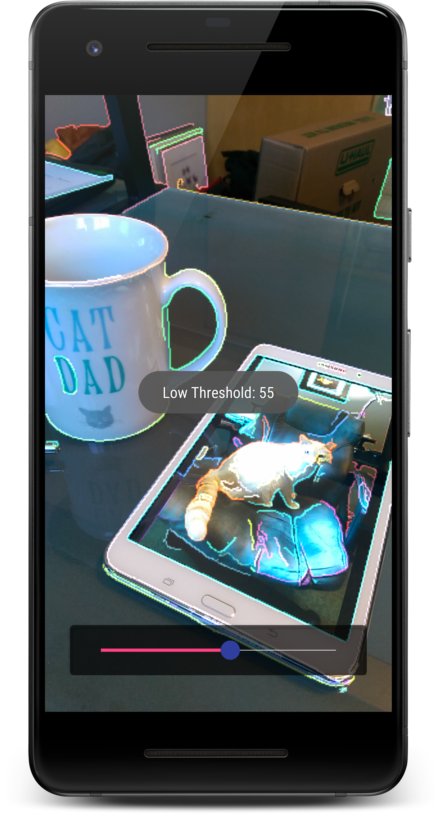
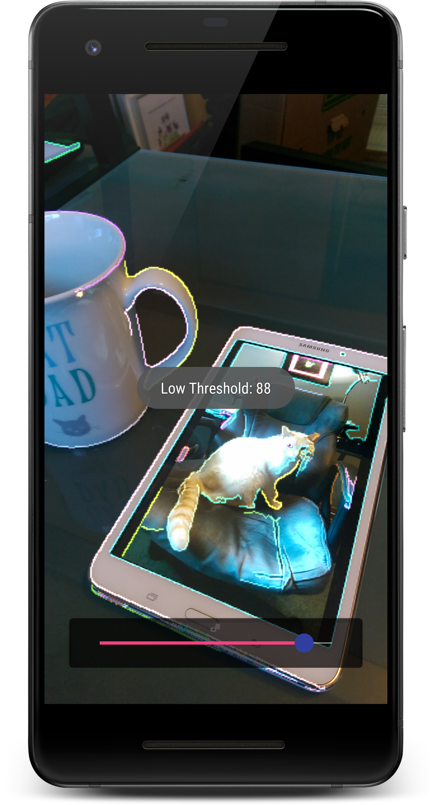
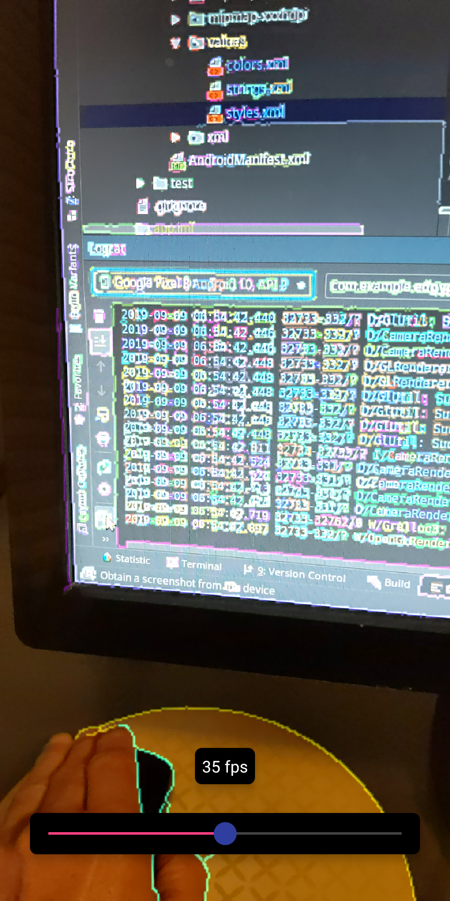

## Overview

An app to demonstrate how to use OpenGL and OpenCV together on an Android device.

## Screenshots

<p float="left">
   
  
  
  
</p>

## Motivation

While developing an application that assists in Astrophotograhy and Telescope setup, I needed to 
find a more efficient mechanism for passing frame data from the device's camera to my OpenCV
machine vision code that processed the camera data. This project is partially based on the 
OpenCV CameraGLRendererBase class, but does not use the OpenCV camera implementation. This project
uses it's own implementation of the Android Camera2 api. A better version of this app can be realized
by using an auto-sizing TextureView, but that is not going to be shown here.

## Code Snippets

Vertex Shader:

```GLSL
#version 300 es

// The matrix the camera internally applies to the output it produces
uniform mat4 cameraTextureMatrix;

// MVP matrix for the quad we are drawing
uniform mat4 mvpMatrix;

in vec4 position;
in vec4 texturePosition;

out vec2 cameraTextureCoordinate;

void main() {
    cameraTextureCoordinate = (cameraTextureMatrix * texturePosition).xy;
    gl_Position = mvpMatrix * position;
}
```

OES Fragment Shader:

```GLSL
#version 300 es
#extension GL_OES_EGL_image_external : enable
#extension GL_OES_EGL_image_external_essl3 : enable

precision mediump float;

uniform samplerExternalOES cameraTexture;

in vec2 cameraTextureCoordinate;
out vec4 fragmentColor;

void main () {
    vec4 color = texture(cameraTexture, cameraTextureCoordinate);
    fragmentColor = color;
}
```

2D Fragment Shader:

```GLSL
#version 300 es

precision mediump float;

uniform sampler2D sampler2DTexture;

in vec2 cameraTextureCoordinate;
out vec4 fragmentColor;

void main () {
    vec4 color = texture(sampler2DTexture, cameraTextureCoordinate);
    fragmentColor = color;
}
```

Compile Shaders:

```Kotlin
private fun initShaders() {

        val version = GLES30.glGetString(GLES30.GL_VERSION)
        if (version != null) { Timber.d("OpenGL ES version: $version") }

        // Compile programOES fragment shader
        mProgramOES = ctx.let {
            GlUtil.instance.createProgram(it, VERTEX_SHADER, FRAGMENT_SHADER_OES)
        }
        check(mProgramOES != 0) { "Failed to create mProgramOES" }

        vPositionHandleOES = GLES30.glGetAttribLocation(mProgramOES, POSITION)
        vTexturePositionHandle = GLES30.glGetAttribLocation(mProgramOES, ATTR_TEXTURE_POSITION)
        mCameraTextureMatrixHandle = GLES30.glGetUniformLocation(mProgramOES, UNIFORM_CAMERA_MATRIX)
        mvpMatrixHandle = GLES30.glGetUniformLocation(mProgramOES, MVP_MATRIX)
        GLES30.glEnableVertexAttribArray(vPositionHandleOES)
        GLES30.glEnableVertexAttribArray(vTexturePositionHandle)

        // Compile program2D fragment shader
        mProgram2D = ctx.let {
            GlUtil.instance.createProgram(it, VERTEX_SHADER, FRAGMENT_SHADER_2D)
        }
        check(mProgram2D != 0) { "Failed to create mProgram2D" }

        vPositionHandle2D = GLES30.glGetAttribLocation(mProgram2D, POSITION)
        vTexturePositionHandle2D = GLES30.glGetAttribLocation(mProgram2D, ATTR_TEXTURE_POSITION)
        GLES30.glEnableVertexAttribArray(vPositionHandle2D)
        GLES30.glEnableVertexAttribArray(vTexturePositionHandle2D)
}
```

OpenCV Edge Detection:

```C++
extern "C" void Java_com_example_edgygl_activities_MainActivity_processImage(

        JNIEnv *env,
        jobject instance,
        jint textureIn,
        jint textureOut,
        const jint width,
        const jint height,
        const jint lowThreshold) {

    /// ratio of Low canny threshold to High canny threshold
    const int THRESHOLD_RATIO = 4;

    /// adjust for best combination of speed and performance
    const int SCALE_FACTOR = 4;

    RNG rng(COLOR_RANGE);

    /// timing variables (not used at this time) (pun)
    auto startTime = (double) getTickCount();
    auto endTime = (double) getTickCount();

    /// create a mat the size of the preview and read pixels from GL texture into the mat
    static UMat inputMat;
    inputMat.create(height, width, CV_8UC4);
    glReadPixels(0, 0, inputMat.cols, inputMat.rows, GL_RGBA, GL_UNSIGNED_BYTE, inputMat.getMat(ACCESS_WRITE).data);

    /// re-size the mat to a smaller dimension to keep processing time to a reasonable level
    Mat reSized;
    cv::resize(inputMat, reSized, cv::Size(inputMat.cols / SCALE_FACTOR, inputMat.rows / SCALE_FACTOR));

    /// convert the image to grayscale
    UMat gray_image;
    cvtColor(reSized, gray_image, COLOR_BGRA2GRAY);

    /// Reduce noise with a 3x3 kernel
    Mat blurred;
    GaussianBlur(gray_image, blurred, Size(3, 3), 0);

    /// create new cv::Mat, canny it and convert
    Mat cannyMat(height, width, CV_8UC1);
    Canny(blurred, cannyMat, lowThreshold, lowThreshold * THRESHOLD_RATIO, 3);

    /// Find contours
    vector<vector<Point> > contours;
    vector<Vec4i> hierarchy;
    findContours(cannyMat, contours, hierarchy, RETR_TREE, CHAIN_APPROX_SIMPLE, Point(0, 0));

    /// Draw contours
    Mat drawing = Mat::zeros( cannyMat.size(), CV_8UC4 );
    for( int i = 0; i< contours.size(); i++ )
    {
        // get a random color
        Scalar color = Scalar(
                rng.uniform(0, COLOR_RANGE_TOP),
                rng.uniform(0, COLOR_RANGE_TOP),
                rng.uniform(0, COLOR_RANGE_TOP) );

        // draw the contour using the random color
        drawContours(drawing, contours, i, color, 1, LINE_8, hierarchy, 0, Point());
    }

    /// resize the image back to it's original dimensions
    cv::resize(drawing, reSized, cv::Size(inputMat.cols, inputMat.rows), INTER_LINEAR);

    /// add the two layers together into the collimation mat
    addWeighted(reSized, 1.00, inputMat, 1.00, 0.0, inputMat);

    /// set the active texture
    glActiveTexture(GL_TEXTURE0);

    /// bind to the active texture
    glBindTexture(GL_TEXTURE_2D, static_cast<GLuint>(textureOut));

    /// specify a two-dimensional texture sub-image
    glTexSubImage2D(
            GL_TEXTURE_2D,
            0,
            0,
            0,
            inputMat.cols,
            inputMat.rows,
            GL_RGBA,
            GL_UNSIGNED_BYTE,
            inputMat.getMat(ACCESS_READ).data
    );
}
```

## License

Licensed under the Apache License, Version 2.0 (the &quot;License&quot;);
you may not use this file except in compliance with the License.
You may obtain a copy of the License at
http://www.apache.org/licenses/LICENSE-2.0
Unless required by applicable law or agreed to in writing, software
distributed under the License is distributed on an &quot;AS IS&quot; BASIS,
WITHOUT WARRANTIES OR CONDITIONS OF ANY KIND, either
express or implied.
See the License for the specific language governing
permissions and limitations under the License.